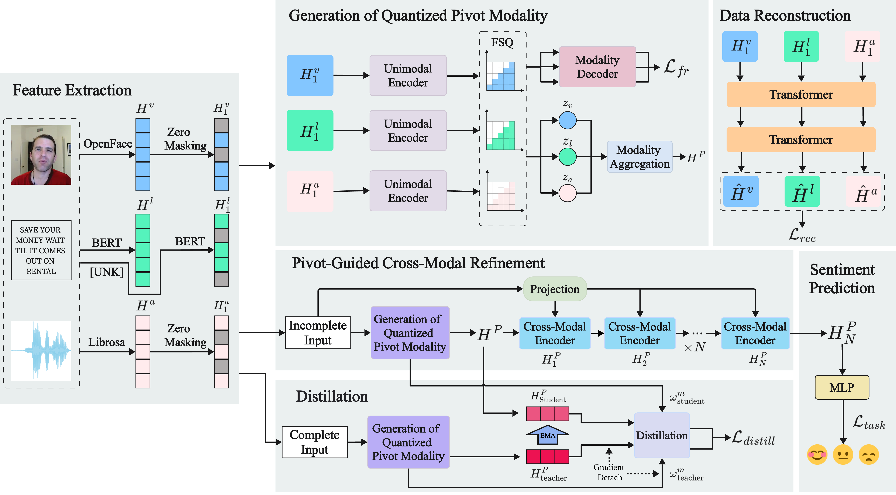

# QDRF: Quantized and distilled robust fusion for incomplete data in multimodal sentiment analysis

This repository provides the PyTorch implementation of **QDRF**, introduced in our paper published in *Information Sciences*, 758 (2027), Article 123966.

[[Paper](https://doi.org/10.1016/j.ins.2026.123966)]

QDRF addresses multimodal sentiment analysis when one or more modalities are incomplete. 

## Main components

- **Quantized semantic pivot:** FSQ maps multimodal information into a compact discrete representation that is less sensitive to missing-modality noise.
- **Pivot-guided cross-modal refinement:** the learned pivot guides the interaction and fusion of language, visual, and acoustic features.
- **Asymmetric teacher-student distillation:** an exponential-moving-average teacher learns from complete modalities and supervises the student under incomplete inputs.
- **Dual alignment:** feature-level mean-squared-error alignment and weight-level Kullback-Leibler alignment transfer both semantic information and modality-importance patterns.

## Relation to P-RMF

This implementation is developed from the [P-RMF codebase](https://github.com/aoqzhu/P-RMF), but the method implemented and reported here is **QDRF**, not a renamed release of P-RMF. The principal methodological changes are the FSQ-based discrete pivot, pivot-guided feature refinement, and asymmetric teacher-student distillation with dual alignment.

The primary model file and class are named `QDRF`. References to `P-RMF` below identify the upstream codebase and related work, not the name of the method implemented in this repository.

## Repository structure

```text
configs/                 Training and evaluation configurations
core/                    Dataset, loss, metric, scheduler, and utility code
models/                  QDRF model and network components
log/                     Directory placeholder; generated logs are ignored
train.py                 Main training entry point
robust_evaluation.py     Evaluation under missing modalities
```

## Environment

The experiments reported in the paper used:

- Windows
- Python 3.9
- PyTorch 1.8.0
- One NVIDIA GeForce RTX 4070 Laptop GPU with 8 GB memory

Create an environment from the repository root:

```bash
conda create -n qdrf python=3.9
conda activate qdrf
```

The current `requirements.txt` targets a legacy PyTorch 1.8.0 CUDA 11.1 environment. Install the appropriate PyTorch build for your CUDA setup, and then install the remaining dependencies:

```bash
python -m pip install -r requirements.txt
```

## Data preparation

CMU-MOSI, CMU-MOSEI, and CH-SIMS can be prepared with [MMSA](https://github.com/thuiar/MMSA). Dataset files are not distributed with this repository.

The current configurations expect the following processed feature files:

| Dataset | Configuration | Expected feature file | Feature dimensions (T/V/A) |
| --- | --- | --- | --- |
| CMU-MOSI | `configs/train_mosi.yaml` | `unaligned_50.pkl` | 768 / 20 / 5 |
| CMU-MOSEI | `configs/train_mosei.yaml` | `unaligned_50.pkl` | 768 / 35 / 74 |
| CH-SIMS | `configs/train_sims.yaml` | `unaligned_39.pkl` | 768 / 709 / 33 |

Before training or evaluation, update `dataset.dataPath` in the selected YAML file so that it points to the processed pickle file on your machine. For example:

```yaml
dataset:
  datasetName: mosi
  dataPath: data/CMU-MOSI/Processed/unaligned_50.pkl
```

The English datasets use `bert-base-uncased`, and CH-SIMS uses `bert-base-chinese`. These models must either be downloadable from Hugging Face or already available in the local cache.

## Training

Run commands from the repository root after setting `dataset.dataPath`.

```bash
# CMU-MOSI
python train.py --config_file configs/train_mosi.yaml --seed 1111

# CMU-MOSEI
python train.py --config_file configs/train_mosei.yaml --seed 1111

# CH-SIMS
python train.py --config_file configs/train_sims.yaml --seed 1111
```

The main experiments in the paper use random seeds **1111, 1112, and 1115**. Repeat each command with the other two seeds to reproduce the three-run protocol.

Training writes metric-specific checkpoints under `ckpt/<dataset>/`, with filenames such as:

```text
ckpt/mosi/best_test_Has0_acc_2_1111.pth
```

Because different metrics emphasize different aspects of sentiment prediction, the best classification checkpoint and the best regression checkpoint may come from different epochs.

## Evaluation

Example evaluation commands are:

```bash
# CMU-MOSI: binary accuracy
python robust_evaluation.py --config_file configs/eval_mosi.yaml --key_eval Has0_acc_2

# CMU-MOSEI: binary accuracy
python robust_evaluation.py --config_file configs/eval_mosei.yaml --key_eval Has0_acc_2

# CH-SIMS: binary accuracy
python robust_evaluation.py --config_file configs/eval_sims.yaml --key_eval Mult_acc_2
```

The paper evaluates missing rates from 0.0 to 0.9 and reports results over seeds 1111, 1112, and 1115.

> **Current evaluator compatibility:** for scalar missing-rate evaluation, `robust_evaluation.py` selects checkpoints for seeds **1111, 1112, and 1115** for all three datasets. The corresponding checkpoint files must exist under `ckpt/<dataset>/` before running the commands above. If `missing_rate_eval_test` is configured as a modality-specific dictionary, the evaluator uses the checkpoint for seed **1115** in that single-evaluation path.

## Checkpoints

Pretrained checkpoints are not stored in Git because of their size. Train them locally with the commands above, or place separately distributed checkpoints in the expected `ckpt/<dataset>/` directory using the filename convention produced by `train.py`.

## Citation

If you use this code or method, please cite:

```bibtex
@article{hou2027qdrf,
  title   = {QDRF: Quantized and distilled robust fusion for incomplete data in multimodal sentiment analysis},
  author  = {Hou, Jiachen and Cheng, Zheyan and Xing, Chen and Li, Yushi and Xiang, Nan and Cai, Shaoyu and Liu, Jie and Pan, Yushan},
  journal = {Information Sciences},
  volume  = {758},
  pages   = {123966},
  year    = {2027},
  doi     = {10.1016/j.ins.2026.123966}
}
```

## Acknowledgements

This codebase is adapted from [P-RMF](https://github.com/aoqzhu/P-RMF), the implementation of [Proxy-Driven Robust Multimodal Sentiment Analysis with Incomplete Data](https://aclanthology.org/2025.acl-long.1075/) by Zhu et al. We thank the authors for releasing their work. The upstream P-RMF project also acknowledges [LNLN](https://github.com/Haoyu-ha/LNLN).

## License

This repository is distributed under the [MIT License](LICENSE). 